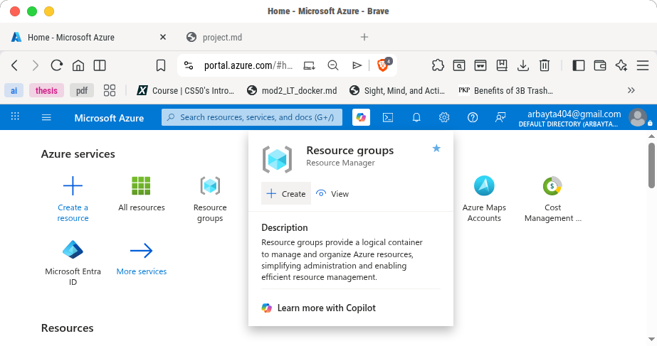
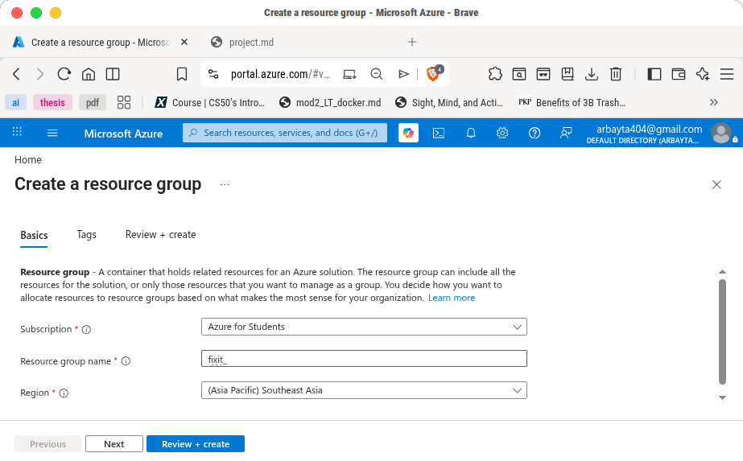
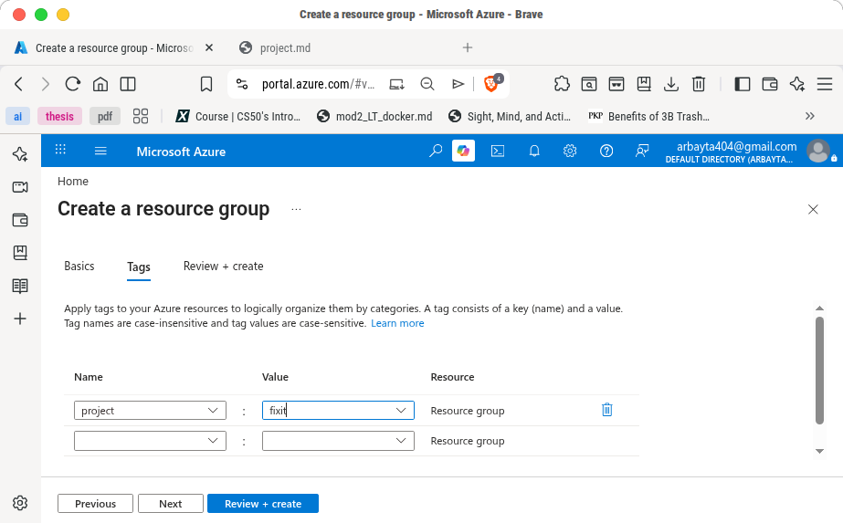
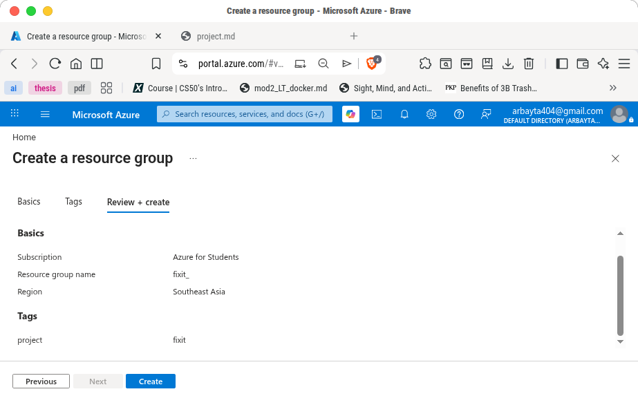
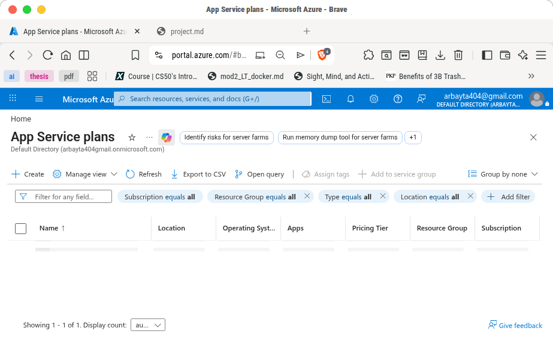
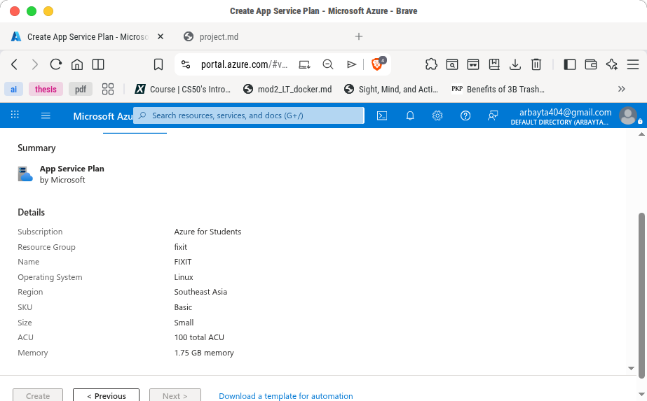
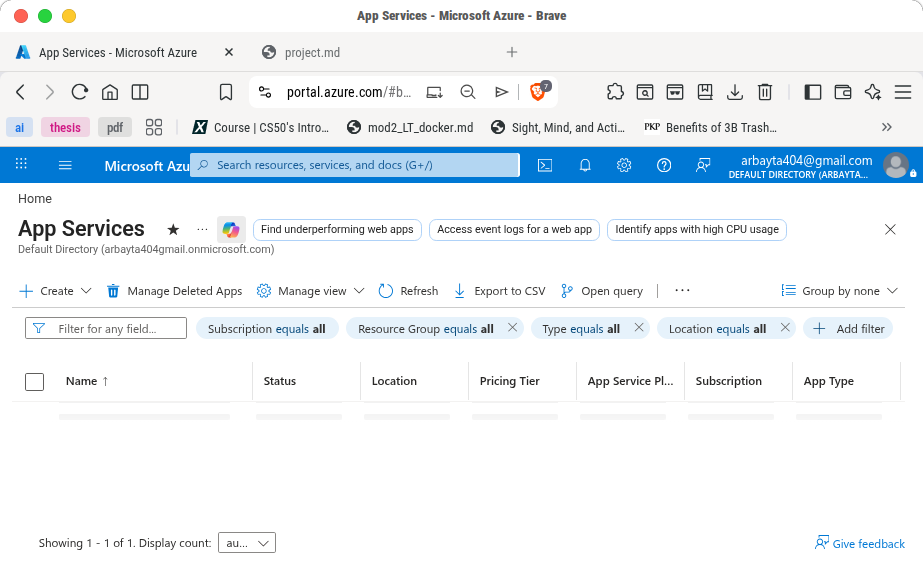
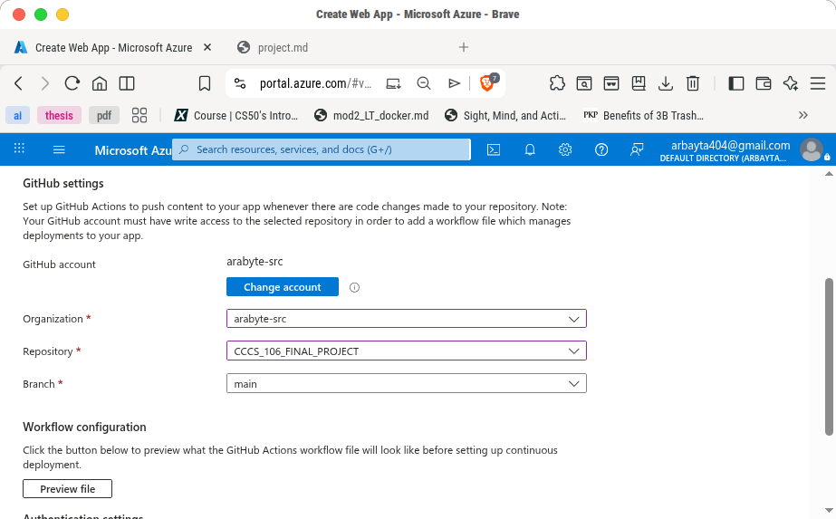
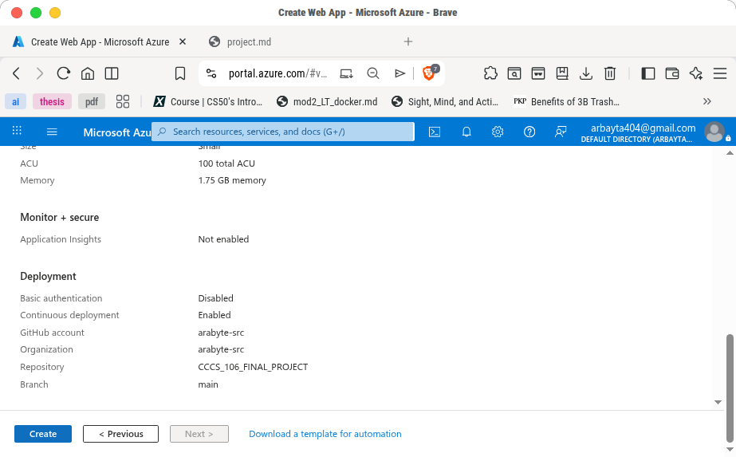

# Azure Web App Deployment Guide

## Overview
This documentation explains the step-by-step deployment process of the web application using Microsoft Azure. The deployment uses the following Azure resources:

| Resource | Purpose |
|---|---|
| Resource Group | Container for all Azure resources |
| App Service Plan | Provides compute resources for the web app |
| App Service | Hosts and runs the web application |

The deployed application uses the following configuration:

| Setting | Value |
|---|---|
| Resource Group | `fixit` |
| Region | `Southeast Asia` |
| Subscription | `Azure for Students` |
| Operating System | `Linux` |
| App Service Plan | `FIXIT (B1: 1)` |
| GitHub Repository | `https://github.com/arabyte-src/CCCS_106_FINAL_PROJECT` |

---

# Phase 1: Create Resource Group

The Resource Group serves as the main container that organizes and manages all Azure resources related to the project.

## Step-by-Step Procedure

### Step 1: Open Azure Portal
Go to the official Microsoft Azure portal:

https://portal.azure.com

Log in using your Azure account.

---

### Step 2: Search for “Resource Groups”
At the top search bar of the Azure portal, type **Resource Groups** and open it. Click the **Create** button.


---

### Step 3: Create a New Resource Group




Fill in the following settings:

| Setting | Selected Value |
|---|---|
| Subscription | Azure for Students |
| Resource Group Name | `fixit` |
| Region | Southeast Asia |

### Brief Explanation
- **Subscription** determines the billing and account ownership.
- **Resource Group Name** identifies the container for all project resources.
- **Region** determines the physical data center location where the resources will be stored.

### Screenshots


---

### Step 4: Review and Create
Click **Review + Create**, then select **Create** after validation succeeds.

---


# Phase 2: Create App Service Plan

The App Service Plan provides the computing resources needed to run the web application.

## Step-by-Step Procedure

### Step 1: Search for “App Service Plans”
In the Azure portal search bar, type **App Service Plans** and open it.

---

### Step 2: Create a New App Service Plan
Click **Create**.

Configure the following settings:

| Setting | Selected Value |
|---|---|
| Resource Group | `fixit` |
| Name | `FIXIT` |
| Operating System | Linux |
| Region | Southeast Asia |
| Pricing Tier | B1 Basic |

### Brief Explanation
- **Linux OS** is lightweight, efficient, and commonly used for hosting modern web applications.
- **B1 Basic Tier** provides dedicated compute resources suitable for small-to-medium web applications.
- The App Service Plan determines the CPU, memory, and scaling capability of the application.

---

### Step 3: Review and Create
Click **Review + Create** and then click **Create** once validation passes.

---


---

# Phase 3: Create App Service

The App Service hosts the deployed web application and allows users to access it online through a public URL.

## Step-by-Step Procedure

### Step 1: Search for “App Services”
In the Azure portal search bar, type **App Services** and open it.

---

### Step 2: Create a Web App
Click **Create** then choose **Web App**.

Configure the following settings:

| Setting | Selected Value |
|---|---|
| Subscription | Azure for Students |
| Resource Group | `fixit` |
| Name | `fixit-app` |
| Publish | Code |
| Runtime Stack | Python / Node.js / chosen framework |
| Operating System | Linux |
| Region | Southeast Asia |
| App Service Plan | `FIXIT (B1)` |

### Brief Explanation
- **Publish: Code** is used for deploying source code directly from GitHub.
- **Linux Operating System** improves compatibility and performance for modern frameworks.
- The selected App Service Plan provides the required compute resources for the web application.

---

### Step 3: Configure Deployment
Under the **Deployment** tab:
- Connect your GitHub account
- Select the repository:
  `CCCS_106_FINAL_PROJECT`
- Choose the deployment branch (commonly `main`)

This enables automatic deployment whenever changes are pushed to GitHub.

---

### Step 4: Review and Create
Click **Review + Create**, then click **Create** after validation completes.

---

## Expected Output
The web application should deploy successfully and generate a public Azure URL similar to:

```text
fixit-app-f9chftckcae4adhw.southeastasia-01.azurewebsites.net
```


# Final Deployment Summary

| Resource | Name | Purpose |
|---|---|---|
| Resource Group | `fixit` | Organizes all project resources |
| App Service Plan | `FIXIT` | Provides compute resources |
| App Service | `fixit-app` | Hosts the web application |

---

# Notes
- All resources were deployed in the **Southeast Asia** region for lower latency and accessibility.
- Linux was selected as the operating system because it is lightweight, stable, and cost-efficient for hosting web applications.
- GitHub integration was configured to enable continuous deployment and easier updates to the application.