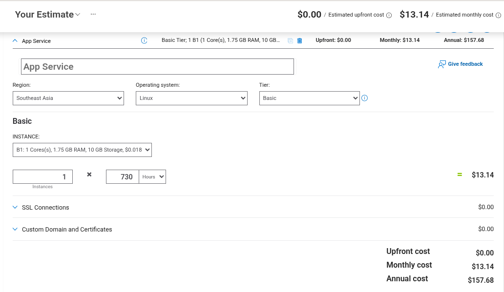

# FIXIT Cost Estimate Report

## Architecture Summary
- Resource Group: fixit
- App Service Plan: FIXIT (Linux, Basic tier)
- Web App: fixit-app (Python 3.11, Linux, Running)

## Itemized Monthly Cost Breakdown
| Resource | Configuration | Estimated Monthly Cost (USD) |
|---|---|---:|
| App Service Plan (FIXIT) | Basic tier, Linux, B1, 1 instance (730 hours) | 13.14 |
| Resource Group (fixit) | No direct charge | 0.00 |
| Web App (fixit-app) | Billed through App Service Plan | 0.00 |
| **Estimated Total** |  | **13.14** |

Estimated annual cost: **157.68 USD**

## Azure Pricing Calculator Screenshot
Insert your completed Azure Pricing Calculator screenshot here.

## Cost Optimization Notes
- Keep the app on Basic tier while traffic is low.
- Scale down or stop non-critical usage during off-hours.
- Use the smallest App Service tier that still meets performance needs.
